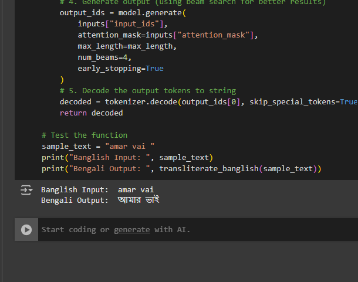

# mt5-banglish2bangla-checkpoints

This model is a fine-tuned version of [google/mt5-small](https://huggingface.co/google/mt5-small) on the None dataset.
It achieves the following results on the evaluation set:
- Loss: 2.9175

 
hf: 
https://huggingface.co/jahangir37/mt5-banglish2bangla-checkpoints

## Training procedure

### Training hyperparameters

The following hyperparameters were used during training:
- learning_rate: 0.0001
- train_batch_size: 8
- eval_batch_size: 8
- seed: 42
- optimizer: Use adamw_torch with betas=(0.9,0.999) and epsilon=1e-08 and optimizer_args=No additional optimizer arguments
- lr_scheduler_type: linear
- num_epochs: 3

### Training results

| Training Loss | Epoch | Step | Validation Loss |
|:-------------:|:-----:|:----:|:---------------:|
| 4.3468        | 1.0   | 501  | 3.3628          |
| 3.8689        | 2.0   | 1002 | 3.0205          |
| 3.6486        | 3.0   | 1503 | 2.9175          |

### Framework versions

- Transformers 4.47.1
- Pytorch 2.5.1+cu121
- Datasets 3.2.0
- Tokenizers 0.21.0
